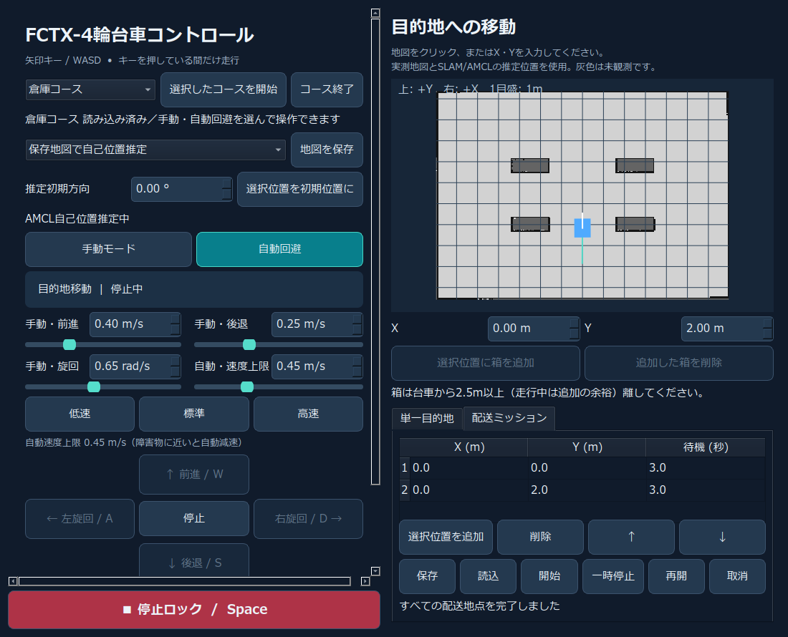

# FCTX-ROS 2 Autonomous Cart Lab

<p align="center"><a href="README.md">English</a> | <b>日本語</b></p>

**障害物回避・SLAM・自己位置推定・自律配送を備えた、4輪台車のシミュレーション環境。**

ROS 2 Jazzy / Gazebo Harmonic上で、台車を手動操作するところから、地図を作り、目的地まで移動し、複数地点へ配送するところまで試せます。日本語GUIで7種類のコースと3種類の位置モードを切り替えられます。

制御・GUI・安全監視・プロセス管理をPythonで実装し、ROS 2の通信でつないでいます。SLAMには `slam_toolbox`、自己位置推定には `nav2_amcl`、IMUと車輪速度の融合には `robot_localization` を使用します。経路計画・追従・配送管理はこのリポジトリの実装です。



## できること

| 機能 | 内容 |
|---|---|
| 手動操作 | WASD・矢印キー・画面ボタンで操作。キーを押している間だけ走行し、画面のフォーカスが外れると入力を解除 |
| 自由走行 | 360°LiDARで候補軌道を比較し、障害物を避けながら進行。周回方向の固定なし |
| 目的地への移動 | 地図上で目的地を選択。A*で経路を作り、到着後に停止 |
| 配送ミッション | 複数地点と待機時間を登録し、順番に移動。ルートの保存・読込・一時停止・取消 |
| 追加障害物への対応 | LiDARで検知した障害物を反映して再計画。通れる経路がなければ停止して待機 |
| SLAM・自己位置推定 | LiDARで占有地図を作成・保存し、再起動後は保存地図でAMCLを実行 |
| 安全監視 | 指令・センサー・位置の更新断、障害物への接近、接触、停止ロックを監視 |
| 操作環境 | 7コースの切替、速度調整、地図クリック、推定初期位置の指定、起動・終了の管理 |

箱の追加・削除ボタンは「シミュレーション位置」モードで使用します。SLAM/AMCLモードでもLiDARによる障害物検知と再計画は有効です。

## 最初に試す

動作検証は **Windows + WSL2 / Ubuntu 24.04 / ROS 2 Jazzy / Gazebo Harmonic** で行いました。初回は [セットアップ](docs/SETUP.md) に従い、ROS 2と依存パッケージを用意してください。

```bash
git clone https://github.com/futurecortexlabs/FCTX-ros2-gazebo-autonomous-cart.git
cd FCTX-ros2-gazebo-autonomous-cart
bash run_courses.sh --course warehouse_course.sdf --pose-source localization --start
```

画面に「読み込み済み」と表示されたら、右側の地図で通行可能な場所を選び、「この目的地へ移動」を押します。起動直後は手動・停止状態です。配送を試す場合は「配送ミッション」から `routes/warehouse_course_coverage_delivery.json` を読み込みます。

[起動・復旧手順](RUNBOOK.md) / [目的地移動](GOAL_NAVIGATION.md) / [配送操作](MISSION_GUIDE.md)

## コースと位置モード

| コース | 特徴 |
|---|---|
| 円形 | 内外の壁で囲んだ基本の周回コース |
| 障害物 | 円形コースに箱2個とポール1個を配置 |
| 楕円 | 直線に近い区間とカーブを持つ周回コース |
| 倉庫 | 外壁と4個の棚を持つ広場 |
| 大型楕円 | 24 × 16 mの周回コース |
| 大型倉庫 | 26 × 20 m、9個の棚を持つコース |
| スラローム | 24 × 16 m、交互に配置した3枚の壁を迂回 |

| 位置モード | 位置・経路計画に使う情報 | 主な用途 |
|---|---|---|
| `simulation` | Gazeboの正解位置とSDFの既知形状 | 制御・GUI・障害物回避の実験 |
| `slam` | EKFオドメトリ、SLAM推定位置、観測した占有地図 | 地図作成と地図に基づく走行 |
| `localization` | EKFオドメトリ、AMCL推定位置、保存した占有地図 | 地図を使った配送 |

SLAM/AMCLモードの制御・安全ゲート・位置推定は正解位置を購読しません。正解位置は外部の精度検証と表示に使用します。全7コースに全周・主要通路の観測地図と `routes/*_coverage_delivery.json` を同梱しています。短い往復のサンプルも残しています。未知セルへの経路は許可せず、未観測の領域はSLAMで観測してから使用します。

## 設計で扱った課題

- **4輪旋回時の滑り**：生の車輪旋回角に頼らず、車輪速度とIMUの姿勢・角速度をEKFで融合。
- **走行指令の安全性**：自動制御と独立したSafetyGateが最終速度を決定。データが古いときはゼロ指令を出力。
- **地図とルートの取り違え**：保存地図をコースのハッシュで照合し、ルートの `world` / `map` 座標系を区別。
- **走行中の環境変化**：LiDAR反射から追加障害物を保持し、新しい観測と経路の再計画へ反映。
- **起動・終了の安定性**：位置・地図の準備を確認し、起動時のみ1回再試行。Gazeboの一時停止を確認してから所有プロセスを終了し、起動直後・切替中の終了にも対応。
- **処理負荷**：距離計算をNumPyでまとめ、内容が同じ地図は距離場・GUI画像を再利用。

通信の流れ・アルゴリズム・ファイルの役割は [ソフトウェア構成](docs/ARCHITECTURE.md) にまとめています。

## 検証実績

**2026-10-03の仕上げ検証**では、全周・主要通路の地図と配送ルートを使いました。

| 試験 | 結果 |
|---|---|
| 付属7地図の観測範囲 | 出発地点からつながる安全領域の観測率100%、地図上の通行可能率86.7〜97.4% |
| 共通最終設定のSLAM全巡回 | 全7コース・105検査地点、接触0、帰還時の最大推定誤差1.95 cm、正常終了 |
| 7コースのAMCL全巡回 | 計98地点、接触0、全配送完了・停止 |
| 帰還時の推定位置と正解位置の差 | AMCL 0.63〜4.52 cm |
| 倉庫AMCLの連続配送 | 30分51秒、11巡回・132地点、接触0 |
| 終了・切替 | AMCL/simulationの9条件、SLAMの7条件、最終GUIの4条件を版別に記録 |
| 追加障害物・位置更新断 | 再計画と到着、AMCL停止時の安全停止・復帰を確認 |
| 静的・初回診断 | 単体試験17入口、実行器6条件、別コピーの依存・全7地図診断が成功 |
| 描画環境 | 同じマシンのWSL描画とllvmpipeで配送・正常終了を確認 |

観測率の分母は、車体半径と余裕を考慮した、出発地点からつながる参照領域です。内壁に囲まれた孤立領域は含みません。地図の通行可能率は障害物・未知セルの膨張後の別指標です。位置誤差は帰還時の推定値と正解値の差で、目的地までの残距離とは異なります。条件、SLAM設定の比較、試験結果JSON、再実行方法は [検証と適用範囲](docs/VALIDATION.md) を参照してください。

## リポジトリ構成

```text
launch/       Gazebo・ブリッジ・制御・SLAM/AMCLの一括起動
scripts/      制御、GUI、経路計画、地図保存、診断、検証
config/       EKF・SLAM・AMCLの設定
worlds/       4輪台車・センサー・7コースのSDF
maps/         コース別の占有地図と整合性メタデータ
routes/       座標系付き配送サンプル
fonts/        日本語フォントの設定
validation/   日付ごとの保存済み検証結果
docs/         セットアップ、構成、検証、画面例
tests/        最適化前実装などの検証用参照データ
```

実行時のログ・PID・スクリーンショットは `logs/` に作られ、Gitには含めません。Windowsのフォントファイルも同梱しません。

## 文書案内

| 知りたいこと | 文書 |
|---|---|
| 依存パッケージと初回起動 | [セットアップ](docs/SETUP.md) |
| 起動・停止・不具合時の確認 | [RUNBOOK.md](RUNBOOK.md) |
| ソフト構成・通信・主要ファイル | [ソフトウェア構成](docs/ARCHITECTURE.md) |
| コース選択・手動・速度調整 | [COURSES.md](COURSES.md) / [MANUAL_MODE.md](MANUAL_MODE.md) |
| 目的地・配送・追加障害物 | [GOAL_NAVIGATION.md](GOAL_NAVIGATION.md) / [MISSION_GUIDE.md](MISSION_GUIDE.md) / [DYNAMIC_OBSTACLES.md](DYNAMIC_OBSTACLES.md) |
| SLAMと自己位置推定 | [SLAM_LOCALIZATION.md](SLAM_LOCALIZATION.md) |
| 試験条件・結果・再検証 | [検証と適用範囲](docs/VALIDATION.md) / [ACCEPTANCE.md](ACCEPTANCE.md) |
| 最適化と計測条件 | [OPTIMIZATION.md](OPTIMIZATION.md) |
