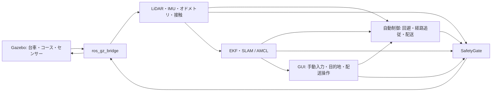

# FCTX-ソフトウェア構成

## 処理の流れ

Gazeboで台車とセンサーを動かし、`ros_gz_bridge`でROS 2に接続します。自動制御とGUIが走行指令を作り、独立したSafetyGateが最終速度を台車へ送ります。



Gazeboの駆動は左右2輪ずつをまとめたDiffDriveです。4輪のスキッドステアなので旋回時に滑りが生じます。LiDARは360°・720点・20 Hz・最大35 m、IMUは100 Hzです。

## 3つの位置モード

| モード | 位置 | 静的な経路地図 | 座標系 |
|---|---|---|---|
| `simulation` | Gazeboの正解オドメトリ | SDFの壁・障害物形状 | `world` |
| `slam` | EKFオドメトリとslam_toolboxの補正 | `/map`で受け取った占有地図 | `map` |
| `localization` | EKFオドメトリとAMCLの補正 | 保存した占有地図 | `map` |

SLAM/AMCLでは次のTFを使用します。

```text
map → wheel_odom → loop_cart/base_link → loop_cart/lidar
```

EKFは車輪オドメトリの前後・横速度と、IMUの相対姿勢・角速度を融合します。車輪が滑って積算旋回角がずれる問題に対応するため、生の車輪TFは同時配信しません。

`localization_bridge.py`はTFから制御用の `/loop/localized_odom` を作ります。IMU・車輪データ・位置補正の鮮度と、AMCLの共分散を確認します。SLAM/AMCLモードの制御・SafetyGate・位置推定は `/loop/ground_truth` に依存しません。

## 回避・経路計画・配送

**自由回避**はLiDAR反射点から障害物を捉え、速度と旋回の候補軌道を約3秒先まで比較します。車体とタイヤを覆う半径0.62 mと余裕を使い、近づきすぎる軌道を除きます。進行方向や固定の周回ルートは指定しません。

**目的地移動**はSDF形状または占有地図から距離場を作り、車体半径と余裕を確保したグリッド上でA*を実行します。経路に沿って進み、曲がり角では向きを合わせます。最大指令速度は0.55 m/s、到着判定は使用中の推定位置から0.18 m以内です。

`slam_toolbox`と`nav2_amcl`は地図作成・位置推定に使用します。経路計画・追従にNav2のナビゲーション一式は使用していません。

**追加障害物**はLiDAR反射と静的地図との差から検知します。セル単位で保持し、通行可能という新しい観測が得られた場所を更新します。地図更新で既知の固定障害物になった点は動的集合から外し、二重の膨張を避けます。未知セルは固定障害物の根拠に使いません。一定時間が過ぎただけで障害物を消す方式ではありません。経路へ反映して再計画し、経路がない間は停止します。

**配送管理**は地点一覧、待機時間、現在の配送先、一時停止・完了・取消の状態を管理します。ルートJSONにはコース名と `world` / `map` を保存し、異なるコースや座標系のルートは拒否します。地図もSDFのSHA-256で一致を確認します。

## 安全とプロセス管理

SafetyGateは自動指令 `/loop/cmd_raw` と手動指令 `/loop/cmd_manual` を選択し、最終指令 `/loop/cmd_vel` を出力します。

| 監視内容 | 現行の動作 |
|---|---|
| 指令更新 | 0.35秒以上更新されなければ停止 |
| LiDAR・制御用位置 | 0.25秒以上古ければ停止 |
| LiDARの異常 | 無効な測定・必要な方向の観測不足なら停止 |
| 近接 | LiDAR中心から全周0.78 m以内、移動方向0.95 m以内なら停止 |
| 速度 | 障害物との残り距離と反応・制動時間から上限を下げる |
| 接触 | 壁・障害物との接触をラッチし、再起動まで停止 |
| 手動操作 | キー解除・フォーカス喪失で入力解除。モード切替時は一度停止 |

距離の閾値はLiDAR中心からの値です。車体表面との距離と混同しないようにしています。位置中継側でもIMUの0.3秒更新断や走行中の補正停止を検知すると、制御用位置の配信を止めます。

`course_selector.py`は一度に1つの起動プロセスを所有します。起動完了はプロセスの存在だけでなく、位置・地図・状態の準備で判断します。起動失敗は1回だけ再試行し、準備の上限は60秒です。起動完了後の異常終了では自動再開しません。

終了時はゼロ指令を出し、Gazeboの一時停止が統計へ反映されたことを確認し、SLAMの場合はlifecycle deactivateを完了してから所有launchへSIGINTを送ります。起動中のSLAM中止は準備を最大20秒待ってからdeactivateとSIGINTへ進み、AMCL/simulationの起動中止は直接SIGINT、無応答時は所有要求・プロセスだけを有限時間で回収します。終了要求を回収する前に次のコースを起動しません。待機中は操作画面の入力を無効にし、Qt timersとROS受信で終了を監視します。`run_loop.sh`のファイルロックは二重起動を防ぎます。

## 主要ファイル

| ファイル | 役割 |
|---|---|
| `launch/loop_course.launch.py` | Gazebo、ブリッジ、制御、推定器を構成 |
| `scripts/course_selector.py` | コース・位置モード選択、起動監視、切替、地図保存 |
| `scripts/manual_panel.py` | 手動入力、速度調整、停止、ROSサービス呼出し |
| `scripts/goal_panel.py` / `mission_panel.py` | 地図表示、目的地・配送のUI |
| `scripts/loop_controller.py` | 自動制御と独立SafetyGateを別プロセスで実行 |
| `scripts/obstacle_avoidance.py` | LiDARによる候補軌道の評価 |
| `scripts/goal_navigation.py` | SDF地図、A*経路、経路追従と到着判定 |
| `scripts/occupancy_navigation.py` | 占有地図、未知領域の扱い、距離場 |
| `scripts/dynamic_obstacles.py` | 追加障害物の観測と保持 |
| `scripts/localization_bridge.py` | 推定位置の中継と推定品質の監視 |
| `scripts/mission_control.py` | 配送地点・待機・一時停止・完了の状態管理 |
| `scripts/world_clearance.py` / `loop_core.py` | 形状距離、速度・停止判定 |
| `scripts/map_cache.py` | 同一地図の識別と再計算の抑制 |
| `scripts/save_slam_map.py` | 地図画像・YAML・コースメタデータの保存 |
| `config/ekf.yaml` / `slam.yaml` / `amcl.yaml` | 推定器の設定 |
| `scripts/build_*courses.py` / `build_loop_world.py` | 台車とコースのSDF生成 |
| `scripts/test_*.py` / `validate_*.py` | ロジック・GUI・Gazebo統合の検証 |

## 推定と処理負荷

旋回時の滑りに対応するため、IMUと車輪速度を融合します。大型倉庫の外周壁を観測できるLiDAR距離を設定し、補正TFの更新を監視します。対称な円形・楕円壁には識別を助ける形状の目印があります。

NumPyの一括距離計算と同一地図の再利用で処理負荷を削減しました。合成入力でのLiDAR更新中央値は42.669 msから3.742 msでした。これは該当処理の計測であり、シミュレーション全体のFPSではありません。[計測条件](../OPTIMIZATION.md) と [検証範囲](VALIDATION.md) を合わせて参照してください。

## 検証ファイル

| ファイル | 確認する内容 |
|---|---|
| `scripts/validate_map_coverage.py` | SLAM全巡回、観測率と通行可能率、保存ルートの全区間、失敗時の地図・ルート復元 |
| `scripts/validate_saved_routes.py` | 付属地図でのAMCL再起動、全地点配送、外部誤差、完了停止 |
| `scripts/validate_endurance.py` | 指定時間と保存ルートでの配送反復、更新の鮮度、接触、RSS |
| `scripts/validate_shutdown_timing.py` | 起動中・準備完了直後・切替中・GUI表示ありの正常終了 |
| `scripts/validation_processes.py` | 所有launchの終了コード、強制終了、同じプロセス群と捕捉済み子プロセスの残存 |
| `scripts/validate_release.py` | 単体試験、実行器の終了コード・タイムアウト、生成物を除いたコピーの初回診断 |

検証器は正解位置を外部測定に使い、製品のSLAM/AMCL制御へ入力しません。試験ごとの設定・ソースSHA・対象地図は `validation/20261003/` に記録しています。
